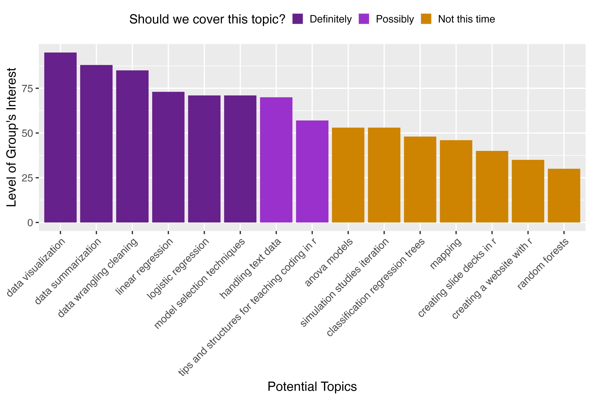

# Data Analysis with R

Materials for the first session 
of the spring 2025 workshop series, "Data Analysis with R", 
for Bucknell Faculty and Staff.

This day covers:

* Workshop goals
* An introduction to `R` and RStudio
* An introduction to and engagement with Quarto documents.

[Here's the list of topics and tentative schedule](https://docs.google.com/spreadsheets/d/1cxYbHk5D_Jkh6nMahqio5eq4zOwnVbeleTcsos6blhs/edit?usp=sharing).  
Vote on the schedule by Feb 3rd.  Calendar invites will be sent on the 4th.

The schedule was set based on the interests of the group:

These are key and interconnected components of the data analysis workflow:

{width=50%}
